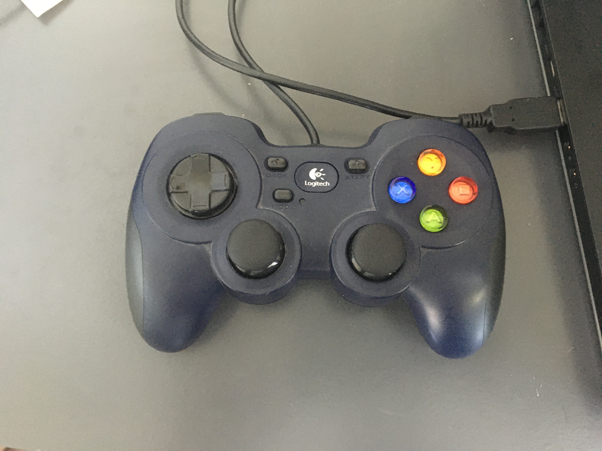
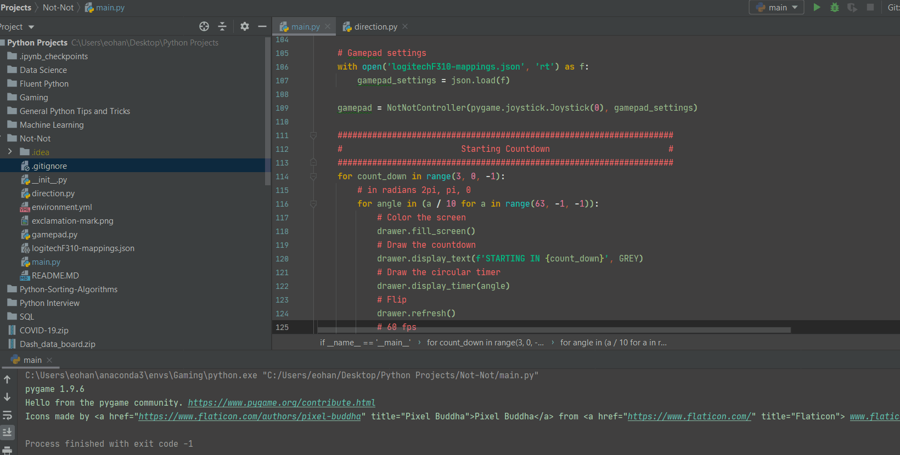

# NOT NOT Game Clone

This is my first time creating a game with python. Since I love puzzles, I decided to start by building the game Not Not.

The most basic version of Not Not is needing to travel in the direction that game tells you. So up, down, left, or right. More challenging levels include logical statements with directions like "not left and not right". Right now the most basic version of the game has been implemented along with harder commands like not not not left.
 
The program is able to read commands from a USB controller. In my case I'm using a Logitech F310 Gamepad. 

I built a Gamepad class that should be general enough to work with most controllers with slight modifications here and there.

Here is a gif of me playing the second hardest level currently.

